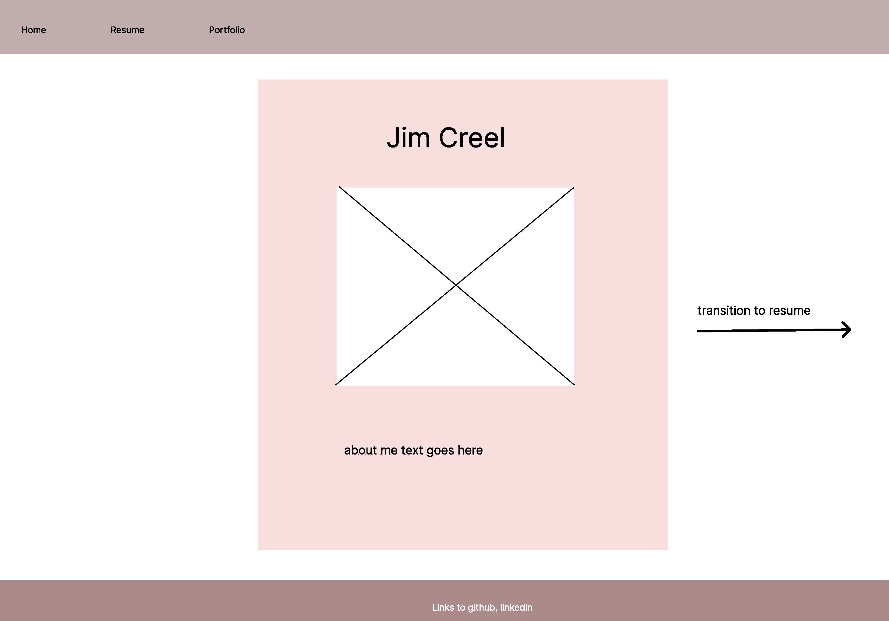
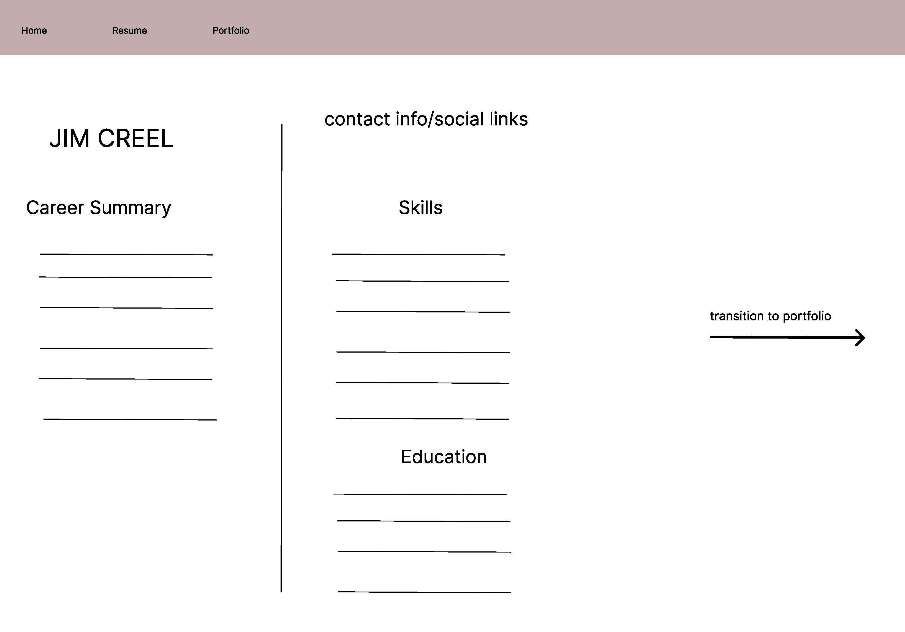
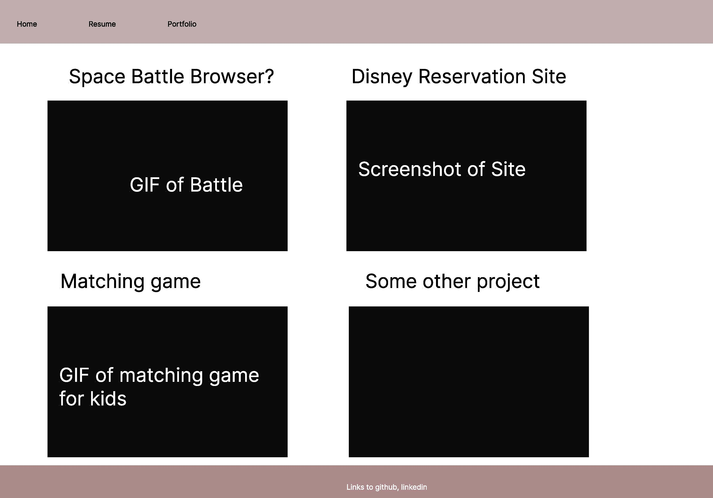

# Jim Creel Portfolio

## Technologies Used

- JavaScript
- HTML
- CSS
- Bootstrap
- AJAX
- AWS
- Python

## Installation Instructions

- clone the repository
- open index.html in a browser

## User Stories

- As a recruiter, I want to be able to quickly assess a candidate to see if they have the credentials and expertise requested by the client, so that I can determine whether or not to move them forward in the process.

- As a hiring manager, I want to be able to easily move in between the candidate's projects so that I can see how they approach problem solving in real-world applications.

- As a headhunter, I want to quickly identify people who demonstrate a potential for interesting work, so that I can see how they fit within the existing framework of my agency.

## Wireframes

## Unsolved Problems

- image carousel chevrons are not active on Safari. They work perfectly on Chrome, so I'm not sure what the issue is. I'll switch out to a different font or an image to fix it.
- space battle alerts and game text are very basic. I'd like to switch it up to an 8bit font and make the game over/you win text more cinematic. I'll probably add a middle ground div or a modal to present these
- the disney site monthly calendar is not well-designed. I'm working on a monthly calendar that can be more flexible, but the sizing is giving me trouble. The site is probably due for an overhaul